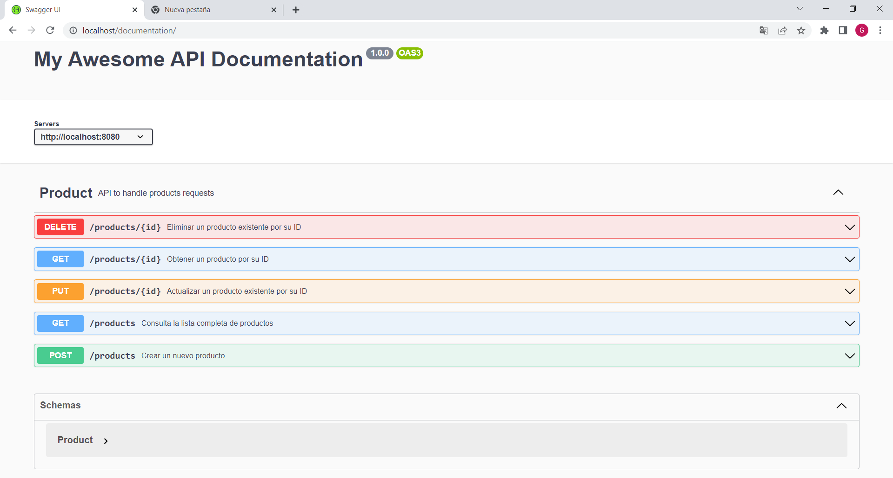

# Proyecto Final

 > Configuración inicial

Instalamos las dependencias con npm install

Utilizamos mongoose para almacenar los datos de los usuarios. Ejecutamos como administrador la base de datos en el cmd

```
mongod --dbpath “C:\Program Files\MongoDB\miBaseDeDatos” 
```


##  PERSISTENCIA

> PRODUCTOS

De acuerdo a si iniciamos en modo de producción o de desarrollo, los productos se guardarán en MongoDB (en una base de datos llamada backend, en la coleccion products) o en archivo (en public/database/archivos/productos.json), respectivamente. La ruta para acceder a la lista de productos es /products desde thunderClient. Si somos administradores (el cual lo definimos desde la variable ADMIN que se encuentra en el archivo .env), podemos realizar operaciones de POST, PUT y DELETE. 


> ORDENES DE COMPRA

 De acuerdo a si iniciamos en modo de producción o de desarrollo, los productos se guardarán en MongoDB (en una base de datos llamada coderback, en la coleccion carts) o en archivo (en public/database/archivos/carts.json), respectivamente. 

> CHAT

De acuerdo a si iniciamos en modo de producción o de desarrollo, el chat se guardará en MySQL (en una base de datos llamada coderback, en la tabla chats. Para ello debemos correr MySQL en XAMPP ) o en archivo (en public/database/archivos/chats.json), respectivamente. 


## API DOCUMENTATION

En la ruta /documentation se pueden ver las rutas y schemas de los productos. Se utilizó swagger.


## LOGGERS

Se utiliza la librería winston para consologuear la info, warnings y errores, y además para almacenar en archivo los errores y warnings.
## MOTORES DE PLANTILLAS

Se utiliza handlebars 

## BASES DE DATOS

* MongoDB (se utiliza para el almacenamiento de los datos de los usuarios, y de los productos, este último en modo producción)
* MySQL (se utiliza para almacenamiento del chat en modo producción)
* Archivo (se utililza para el almacenamiento de los productos, chats y órdenes de compra en modo de desarrollo)
* Memoria (se utiliza al correr en nodemon con npm run watch)
* Firebase (se utiliza para el almacenamiento de las órdenes de compra en modo producción)


## NGINX

En el proyecto se encuentra el archivo nginx.conf como duplicado del que debería ir en la carpeta nginx. Corremos el mismo con nginx -s reload desde el cmd, y corremos la app. Si vamos al puerto 80 en el browser, veremos que ya estará funcionando nginx. Podemos probar yendo a la ruta /info.

## COOKIES, SESSIONS Y STORAGE

En cookies y sessions almacenamos la key del usuario para autenticar el mismo en cada ruta utilizando passport. En el storage se almacenan los productos del carrito hasta el momento de confirmar la compra.

## AUTENTICACIÓN

Se utiliza passport-local para la autenticación del usuario en el login y su registro. El mismo funciona como un middleware en las rutas de atuh/register y auth/login, y además verifica que el usuario esté autenticado antes de acceder a una ruta que no sea las de logueo o registro. Aparte, está la posibilidad de acceder al sitio web autenticándonos con google.   

## PROCESOS DEL SERVIDOR

Se utiliza el módulo yargs para pasar desde la terminal por parámetro el puerto y si se inicia en modo cluster o fork. Ejemplo:

```
node src/app.js --port=8080 --modo=cluster

```

## ENVÍO DE MENSAJES

* Se utiliza nodemailer para enviar mail al usuario al registrarse y al confirmar una compra desde el carrito.

* Se utiliza twilio para enviar un mensaje de whatsapp al usuario al registrarse.
## TESTING

Se utiliza axios en un archivo por separado ubicado en la carpeta clienteHttp, donde existen los métodos GET y POST de productos implementando faker para generar productos aleatorios. 

Se utiliza supertest, chai y mocha para realizar testing sobre la ruta productos. El mismo se encuentra dentro de la carpeta test, y se puede correr la app escribiendo npm run test en la terminal. 


# WEBSOCKET

En la pestaña chat se encuentra se emplea websocket mostrando el avatar, username y el mensaje en tiempo real. 

## ARQUITECTURA DE CAPAS

Se utiliza la arquitectura en capas compuesta por:

* capa de ruteo: maneja la interfaz de programación de aplicaciones (API)
* capa de servicio: maneja la lógica de negocios del app.
* capa de controlador: contiene las funciones que resolverán cada petición que llegue a cada una de las rutas definidas.
* Data Access Object (DAO): contiene las funciones relacionadas con el acceso a la base de datos
* capa de persistencia: tiene acceso a la base de datos
  
Utiliza el patrón MVC (Modelo Vista Controlador), generando las vistas con HTML on wire (Handlebars) excepto en la ruta /products el cual se acceden a los productos a través de la arquitectura Data on wire, es decir que requeriremos utilizar postman, thunderclient u otra plataforma API para acceder a los datos, realizar consultar, y editarlos.

# Ultimo Feature
## CONFIGURACIÓN DEL ENTORNO

> > Creamos un archivo env.config.js donde definiremos las variables de entorno en función a si elegimos como modo de desarrollo o de producción.

```
import dotenv from 'dotenv';
import path from 'path';

dotenv.config({
    path: path.resolve(process.cwd(), process.env.NODE_ENV+ '.env')
})

export default {
    NODE_ENV: process.env.NODE_ENV || "dev",
    HOST: process.env.HOST || 'localhost',
    PORT: process.env.PORT || 8080,
    API_PERSISTENCE: process.env.API_PERSISTENCE || "MEMORY",
    CART_PERSISTENCE: process.env.CART_PERSISTENCE || "MEMORY"
}
```

> > creamos los archivos dev.env y prod.env

```
//dev.env
CART_PERSISTENCE = "FILE" 
API_PERSISTENCE = "FILE" 
NODE_ENV="dev" 
PORT = 8080
HOST = "localhost"
```

```
//prod.env
CART_PERSISTENCE = "FIREBASE"
API_PERSISTENCE = "MONGO"  
ADMIN = false 
NODE_ENV="prod"
```

> > Modificamos el db.config.js para que haga referencia al archivo env.config y no directo al archivo .env

```
import config from './env.config.js'
export const app = {
    cartPersistence: config.CART_PERSISTENCE,
    apiPersistence: config.API_PERSISTENCE
}
```

> > Modificamos el app.js para que utilice el archivo env.config

```
import config from './options/env.config.js'
import cors from 'cors'
const app = express()
if (config.NODE_ENV=="dev") app.use(cors())
```

> > Podemos correr la app con npm run watch, npm run dev o npm run prod. Lo podemos ver en el package.json

```
"scripts": {
    "start": "node src/app.js",
    "watch": "nodemon src/app.js",
    "dev": "set NODE_ENV=dev&& node src/app.js",
    "prod": "set NODE_ENV=prod&& node src/app.js",
    "test": "mocha src/test/products.test.js"
  },
```

> > Debemos tener en cuenta que como ya iniciamos mongoose para el user, no debemos volver a realizar la conexión con la base de datos, como sucede en el ContenedorMongoDB que utiliza el ProductosDaoMongoDB (por eso hay líneas comentadas en ambos archivos. Además se modificó el MongoDBModel para que tenga los campos que correspondan a la creación del producto).

> Middleware isAdmin 

> > Creamos un middleware isAdmin para verificar si somos administradores 

```
export const isAdmin = (req, res, next) => {
    if (process.env.ADMIN !== "true") {
        res.status(401).send('No tiene los permisos necesarios')
    } else {
        next()
    }
}
```

> > Agregamos la variable ADMIN en el .env, y añadimos el middleware en el archivo apiRouter, en las rutas POST, PUT y DELETE.


> Documentacion API

> > Instalamos swagger

```
npm i swagger-jsdoc swagger-ui-express
```

> > Modificamos el app.js

```
import swaggerJSDoc from 'swagger-jsdoc'
import swaggerUI from 'swagger-ui-express'

const swaggerSpec = {
    definition: {
        openapi: '3.0.0', //es la versión de las especificaciones que usaremos
        info: {
            title: 'My Awesome API Documentation',
            version: '1.0.0'
        },
        servers: [{
            url: 'http://localhost:8080'
        }]
    },
    apis: ["./src/docs/**/*.yaml"]
}

app.use('/documentation', swaggerUI.serve, swaggerUI.setup(swaggerJSDoc(swaggerSpec)))
```

> > Creamos la carpeta docs donde estará la documentación de las rutas de products y el schema